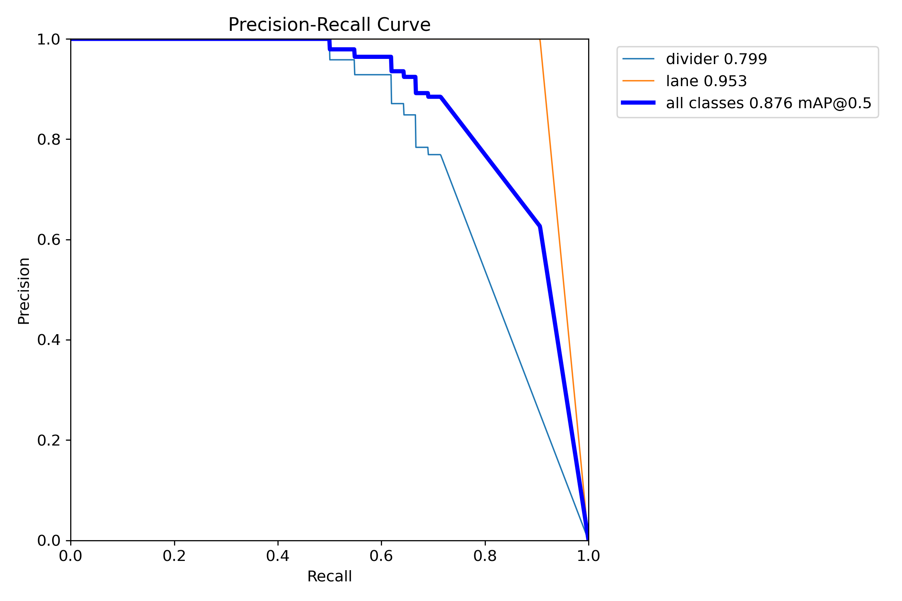

# Introduction

In this project, we advance one step ahead of our previous project, Autonomous Navigation Using Vision Only Mode. 
Previously, we discussed the crucial role of Visual Odometry (VO) in autonomous robotic navigation, especially in 
GPS-denied environments such as planetary terrains or indoor robotic applications. Here, we implement autonomous 
navigation using sensor fusion techniques within a mock smart city that we built from scratch.

 
The main focus is to navigate the robot in indoor environments using built-in sensors such as cameras,
 LiDAR, and IMU. We have constructed a 3D mock smart city and developed our own custom-trained dataset 
 for lanes and traffic signs. Real-time video segmentation feeds are directly sourced from the ZED2 RGB-D data. 
 All setups have been implemented using ROS2 Foxy. Currently, we are working on implementing the path-planning 
 algorithm once we save the map inside the robot using SLAM. For this, we have employed the Cartographer SLAM 
 technique originally developed by Google.

We have introduced four typical application scenarios:

* Local obstacle avoidance

* Real-time video segmentation for lane tracking

* Traffic sign detection

* Indoor navigation and path planning using Nav2

</a>

# Background

In this project, we have presented a ROS-based autonomous navigation system for navigating a mock city. 
We aimed to replicate the complexities of real-world scenarios. Our setup includes traffic signs, both 
two-lane and single-lane roads, and the robot's ability to detect other robotic cars, making decisions 
based on the situation—such as stopping, turning, or moving straight when encountering traffic signs or other robots.

## A. Hardware Implementation

Our robot is a wheeled-based Rosmaster R2 bot equipped with a differential drive system. 
We integrated the powerful Jetson Orin NX into our bot, and it is also equipped with an IMU, 2D YD LiDAR, 
and a ZED2 RGB-D camera with RGB-D data capture capability. 

## B. Software Implementation

We utilized the following software libraries and tools:

* Yahboom car SDK: Ensures seamless integration with the Yahboom robotic hardware, providing necessary control functions and protocols.

* ZED SDK: Provided high-resolution images and depth data, crucial for object detection and distance estimation. 
Enabled accurate 3D mapping and environmental understanding.

* Jetson Orin NX with NVIDIA Jetpack 5.0: Served as the computational backbone, handling intensive data processing and
 model execution. Optimized for AI applications with GPU acceleration.

* YD LiDAR SDK: Facilitated precise distance measurements and environmental mapping, vital for obstacle detection and navigation.

* Ubuntu 20.04: Offered a stable and flexible operating system environment, compatible with ROS2 and other essential libraries.

* ROS2 Foxy: Enabled efficient system integration, data handling, and algorithm implementation. Provided a robust framework for robot control and communication.

## C. Navigation Strategy

Following the background of our project's aims and objectives, our four-wheeled, nonholonomic system, is equipped with LiDAR and an RGB-D camera, which are essential for real-time video segmentation and obstacle detection, facilitating autonomous navigation in a mock city environment.

### Map:

</a>

The navigation strategy involves a combination of sensor fusion and path planning algorithms to navigate towards a target while avoiding obstacles. The robot continuously performs real-time video segmentation to track lanes and detect obstacles, including other R2 bots and various barriers.

When an obstacle is detected, the robot employs an obstacle avoidance algorithm. This involves recalculating its trajectory to balance between avoiding obstacles and moving towards the target position. In unknown environments, the robot's motion planning relies on both sensor data and the relative position of the target to adapt its path.

The robot uses a probabilistic roadmap and a dynamic window approach for local planning. This allows it to navigate dynamically changing environments by adjusting its orientation and velocity. When an obstacle is close, the robot decelerates and rapidly changes its orientation to avoid a collision.

For global path planning, the robot uses the A* algorithm to determine the most efficient path to the target while integrating data from its sensors. The robot’s map is stored on a server, ensuring data availability even in GPS-denied environments.

## D. Results

<table>
  <tr>
    <td></td>
    <td></td>
  </tr>
  <tr>
    <td></td>
    <td></td>
  </tr>
  <tr>
    <td></td>
    <td></td>
  </tr>
  <tr>
    <td></td>
    <td></td>
  </tr>
  <tr>
    <td></td>
    <td></td>
  </tr>
  <tr>
    <td style="text-align: center;"><b>Labels</b></td>
    <td style="text-align: center;"><b>Predctions</b></td>
  </tr>
  <tr>
    <td></td>
    <td></td>
  </tr>
  <tr>
    <td></td>
    <td></td>
  </tr>
</table>

### Real-time Video Result

**1. Without Grass and Model Buildings**

https://github.com/user-attachments/assets/ec784c51-e988-4ae7-b0ae-e84fbf32ae2e

**2. With Grass and Model Buildings**

https://github.com/user-attachments/assets/18d13427-8458-4658-9b05-c885c4553f73

**3. Edge Detection**

https://github.com/user-attachments/assets/61e61170-8cb0-4649-ad07-956de2df4efe

**4. Center line of the Road lane**
Click on the link to view the image

https://github.com/user-attachments/assets/020c6e92-b9f1-434c-9607-97c996127a3f

